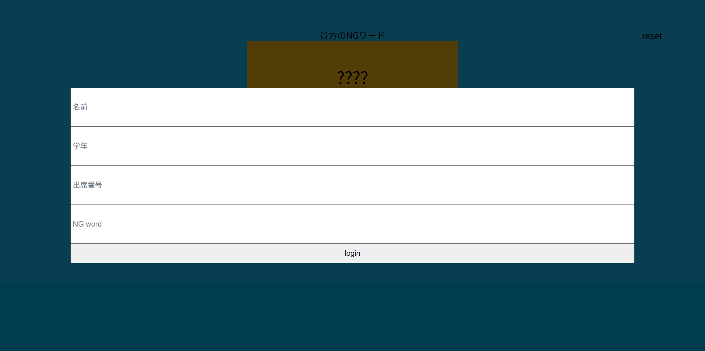

# NG Word Game

2025年コース交流会で使用するために作成された、WebベースのNGワードゲームアプリケーションです。
参加者はチームに分かれ、それぞれが設定した「ワード」が、チーム内の誰かの「NGワード」として割り当てられます。会話の中で相手にNGワードを言わせるゲームです。

<p align="center">
  
  
</p>

## 概要

このアプリケーションは、Node.jsとWebSocketを使用したリアルタイムWebアプリケーションです。
参加者は事前に決められたIDでログインし、自分の「表示名」と「他人へのNGワード候補」を入力します。
全員が揃うとゲームが開始され、他のプレイヤーの背後（画面上）にNGワードが表示されます。

## 詳細機能

*   **リアルタイム通信**: WebSocketを使用し、遅延なくゲームの進行情報を同期します。
*   **チーム分け機能**: `teams.json` に基づき、ログインしたユーザーを自動的にグループに振り分けます。
*   **シャッフルアルゴリズム**: "Derangement"（完全順列）アルゴリズムを使用し、自分が設定した単語が自分に当たらないように、かつランダムにNGワードを割り当てます。
*   **ゲーム進行管理**:
    *   **スタート**: チーム全員が準備完了すると自動的にゲーム画面へ遷移。
    *   **アウト判定**: 画面上のカードをクリック（タップ）することで、そのプレイヤーを「アウト」状態（赤色表示）にできます。
    *   **リセット**: ゲーム終了後、次のラウンドのために状態をリセットできます。
*   **レスポンシブデザイン**: スマートフォンおよびPC（タブレット）での表示に対応しています。

## 使い方

### 1. 準備

Node.jsがインストールされた環境が必要です。

依存パッケージをインストールします。

```bash
npm install
```

### 2. チーム設定

`teams.json` ファイルを編集し、チーム分けを設定します。各配列が1つのチームを表し、その中に参加者のID（例: "2-20"）を文字列で記述します。

```json
[
  ["2-20", "2-19", "3-7"],
  ["2-31", "3-11", "3-24"]
]
```

### 3. 起動

サーバーを起動します。

```bash
node main.js
```

### 4. ゲーム開始

ブラウザで `http://localhost:1200` （またはサーバーのIPアドレス:1200）にアクセスします。

1.  **ログイン**: 配布されたIDを入力します。
2.  **設定**: 自分の「名前」と、誰かに言わせたい「ワード」を入力して待機します。
3.  **プレイ**: 全員揃うと画面が切り替わります。自分のスマホ画面には**自分のNGワードは表示されません**。他の人の画面を見て、会話を誘導しましょう。
4.  **アウト**: NGワードを言ってしまった人がいたら、その人のカードをタップして脱落させます。

## 背景

本プロジェクトは、2025年のコース交流会におけるレクリエーション企画として開発されました。
学年（2年、3年、4年）を超えた交流を促進するため、WebSocketを用いたリアルタイムなインタラクションを実現しています。
